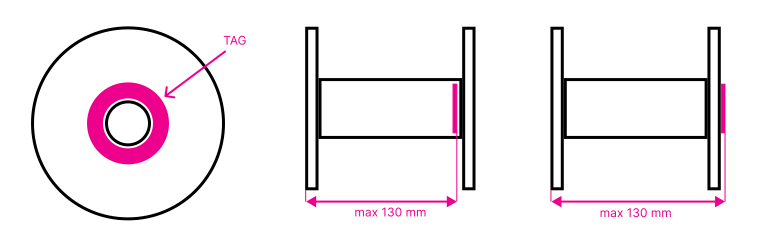

# Physical specification
This document describes the requirements imposed by the OpenPrintTag standard on the physical tag itself, its mechanical and electrical properties. Currently, the **OpenPrintTag standard supports only the reference `OpenPrintTag MK1` tag**. A more generic specification, allowing deviations from the exact reference design and including NFC reader parameters, **will be released later**.

## Reference `OpenPrintTag MK1` tag
`OpenPrintTag MK1` is a passive paper-label NFC tag with an embedded coil and NFC integrated circuit, compliant with the ISO/IEC 15693 vicinity-RFID standard (13.56 MHz).

<a href="media/tag_mk1.pdf">Technical drawing</a>

## Placement guidelines on filament spools
1. The tag SHALL be attached to a flat, non-metallic surface.
1. The tag SHOULD be placed at either flange of the spool (e.g. not in the middle of the barrel) to ensure compatibility with generic readers.
1. The tag SHALL be placed no further than 130 mm from either side of the spool.
    1. *Note: This limitation ensures the tag remains readable from both sides of the spool.*
1. The tag SHALL be positioned coaxially with the central axis of the spool.
1. The design of the material container SHALL provide sufficient mechanical protection of the tag's integrated circuit (IC) during the entire lifecycle.
1. To achieve this, the tag SHOULD be placed inside a debossed pocket or cavity with a minimum depth of 0.25 mm. The cavity MAY be covered to fully enclose the tag.

## Mechanical parameters

<table>
<tr>
<th>Parameter</th>
<th>Min</th>
<th>Typical</th>
<th>Max</th>
<th>Unit</th>
</tr>
<tr>
<td>Shape</td>
<td colspan="4">Circular</td>
</tr>
<tr>
<td>Outer diameter (Ø)</td>
<td align="right">89.5</td>
<td align="right">90</td>
<td align="right">90.5</td>
<td>mm</td>
</tr>
<tr>
<td>Inner diameter (Ø)</td>
<td align="right">63.5</td>
<td align="right">64</td>
<td align="right">64.5</td>
<td>mm</td>
</tr>
<tr>
<td>Coil outer diameter (Ø)</td>
<td align="right">78.6</td>
<td align="right">79.1</td>
<td align="right">79.6</td>
<td>mm</td>
</tr>
<tr>
<td>Coil loop inner diameter (Ø)</td>
<td align="right">73.5</td>
<td align="right">74</td>
<td align="right">74.5</td>
<td>mm</td>
</tr>
<tr>
<td>Top material</td>
<td colspan="4">Paper 80 g/m²</td>
</tr>
<tr>
<td>Top thickness</td>
<td align="right">90</td>
<td align="right">100</td>
<td align="right">110</td>
<td>μm</td>
</tr>
<tr>
<td>Winding material</td>
<td colspan="4">Aluminum foil</td>
</tr>
<tr>
<td>Winding thickness</td>
<td align="right">25</td>
<td align="right">30</td>
<td align="right">35</td>
<td>μm</td>
</tr>
<tr>
<td>Bottom material</td>
<td colspan="4">PET</td>
</tr>
<tr>
<td>Bottom thickness</td>
<td align="right">45</td>
<td align="right">50</td>
<td align="right">55</td>
<td>μm</td>
</tr>
<tr>
<td>Adhesive material</td>
<td colspan="4"><a href="media/adhesive_spec.pdf">Hot Melt Adhesive</a></td>
<tr>
</tr>
<td>Adhesive thickness</td>
<td align="right">15</td>
<td align="right">20</td>
<td align="right">25</td>
<td>μm</td>
</tr>
<tr>
<td>Total thickness</td>
<td align="right">0.14</td>
<td align="right">0.15</td>
<td align="right">0.16</td>
<td>mm</td>
</tr>
</table>

### Electrical parameters
<table>
<tr>
<th>Parameter</th>
<th>Min</th>
<th>Typical</th>
<th>Max</th>
<th>Unit</th>
</tr>
<tr>
<td>Communication protocol</td>
<td colspan="4">ISO/IEC 15693 (NFC-V)</td>
</tr>
<tr>
<td>Integrated Circuit</td>
<td colspan="4"><a href="https://www.nxp.com/docs/en/data-sheet/SL2S2602.pdf" target="_blank">NXP ICODE SLX2</a></td>
</tr>
<td>Communication speed</td>
<td></td>
<td align="right">53</td>
<td></td>
<td>kb/s</td>
</tr>
<tr>
<td>Memory size</td>
<td></td>
<td align="right">316</td>
<td></td>
<td>Byte</td>
</tr>
<tr>
<td>Write endurance</td>
<td></td>
<td align="right">100,000</td>
<td></td>
<td>cycles</td>
</tr>
<tr>
<td>Retention time</td>
<td align="right">10</td>
<td></td>
<td></td>
<td>years</td>
</tr>
<tr>
<td>Operating temperature</td>
<td align="right">+15</td>
<td align="right">+23</td>
<td align="right">+45</td>
<td>°C</td>
</tr>
<tr>
<td>Storage temperature</td>
<td align="right">−55</td>
<td align="right">+23</td>
<td align="right">+80</td>
<td>°C</td>
</tr>
<tr>
<td>Operating frequency</td>
<td align="right">13.553</td>
<td align="right">13.56</td>
<td align="right">13.567</td>
<td>MHz</td>
</tr>
<tr>
<td>Coil type</td>
<td colspan="4">Printed coil</td>
</tr>
<tr>
<td>Number of coil turns</td>
<td></td>
<td align="right">5</td>
<td></td>
<td></td>
</tr>
<tr>
<td>Coil inductance at 13.56 MHz</td>
<td align="right">TBD</td>
<td align="right">6.91</td>
<td align="right">TBD</td>
<td>μH</td>
</tr>
<tr>
<td>Coil DC resistance</td>
<td align="right">TBD</td>
<td align="right">4.565</td>
<td align="right">TBD</td>
<td>Ohm</td>
</tr>
<tr>
<td>Minimum operating voltage on unloaded coil</td>
<td align="right">1</td>
<td align="right">1.1</td>
<td align="right">1.3</td>
<td>V_rms</td>
</tr>
<tr>
<td>Minimum magnetic field strength</td>
<td align="right">12.376</td>
<td align="right">14.8</td>
<td></td>
<td>mA/m_rms</td>
</tr>
</table>
